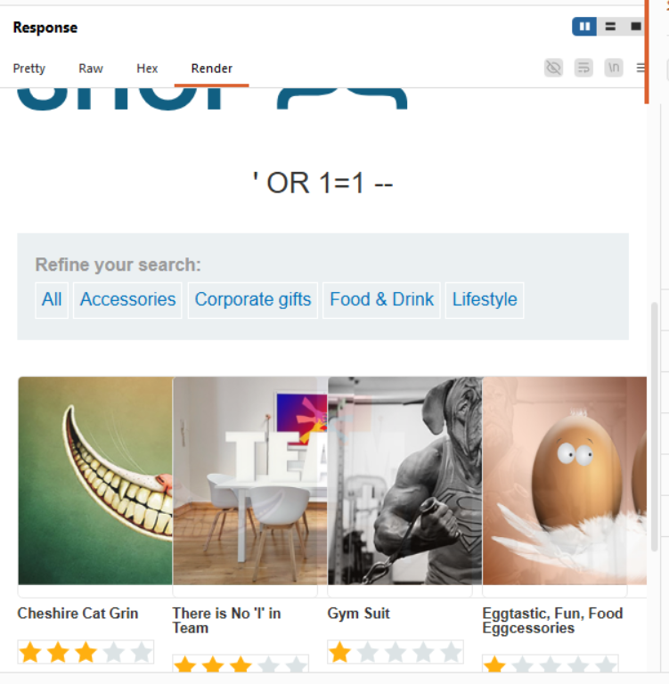

Lab: SQL injection vulnerability in WHERE clause allowing retrieval of hidden data

Plateform : PortSwigger Web Security Academy 
Difficulty : Apprentice
Vulnerability Type : SQL Injection 

Objective 
This lab contains a SQL injection vulnerability in the product category filter. When the user selects a category, the application carries out a SQL query like the following:

SELECT * FROM products WHERE category = 'Gifts' AND released = 1

To solve the lab, perform a SQL injection attack that causes the application to display one or more unreleased products.

Methodology & Exploitation
1. Intercepted the category filter request using **Burp Suite.
2. Noticed the application parameter: `/filter?category=Gifts`
3. Injected a SQL payload to manipulate the query logic and evaluate to true:
   text
   '+OR+1=1--

